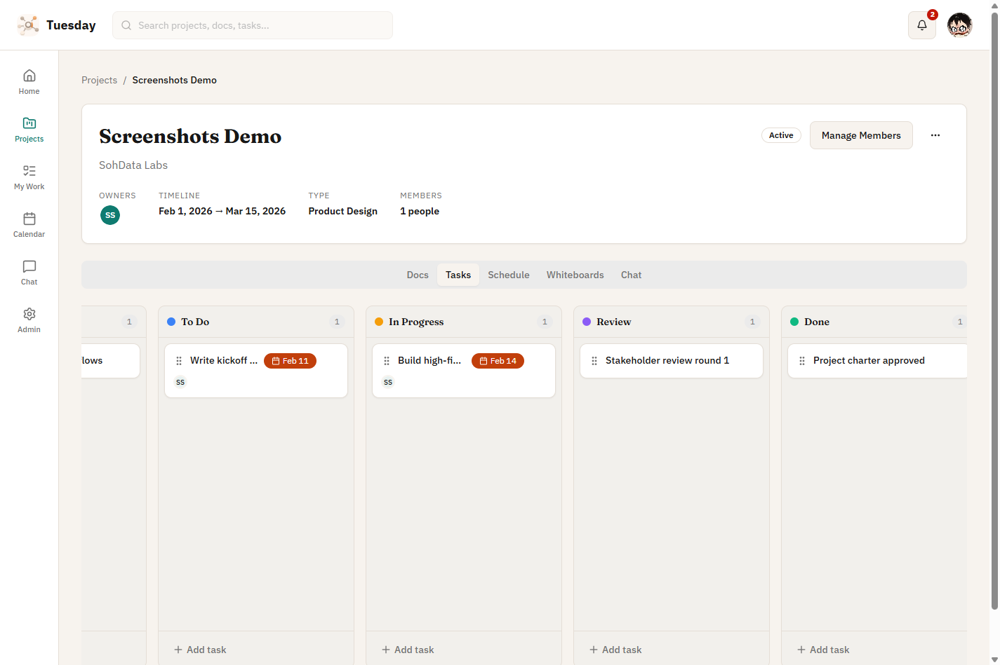
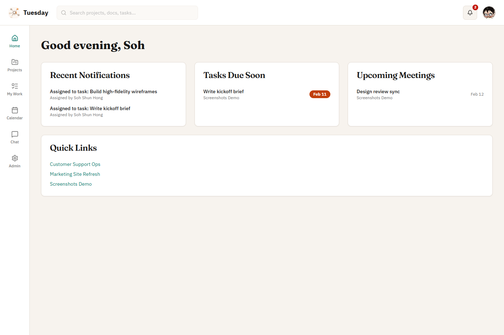
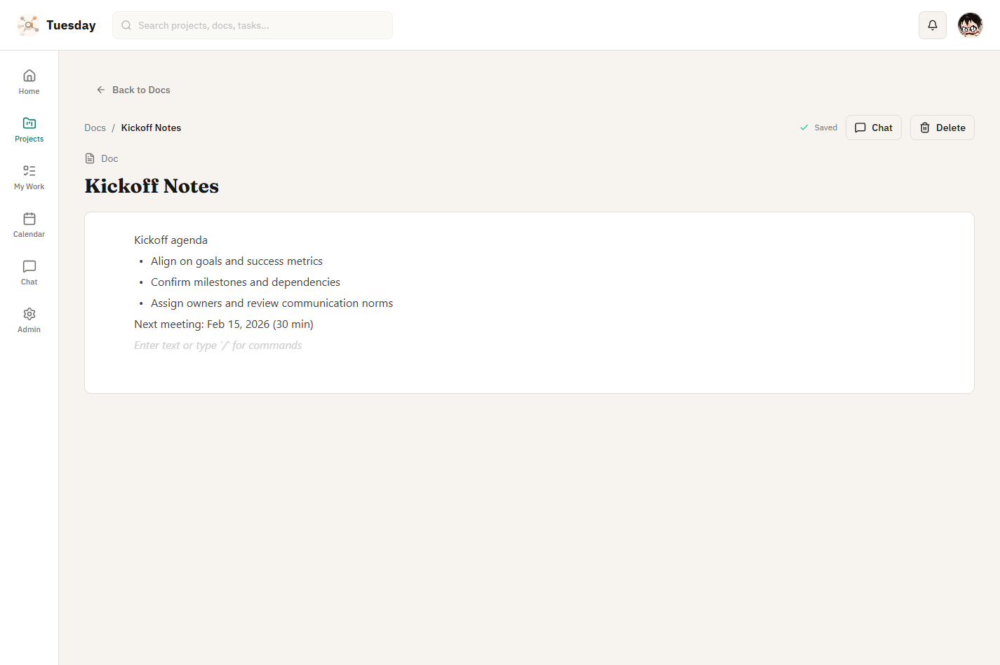
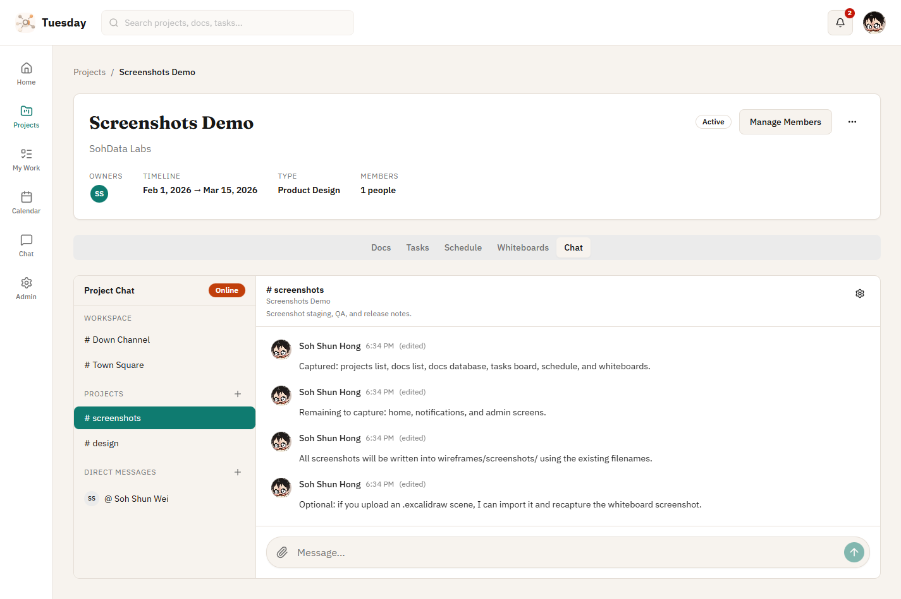
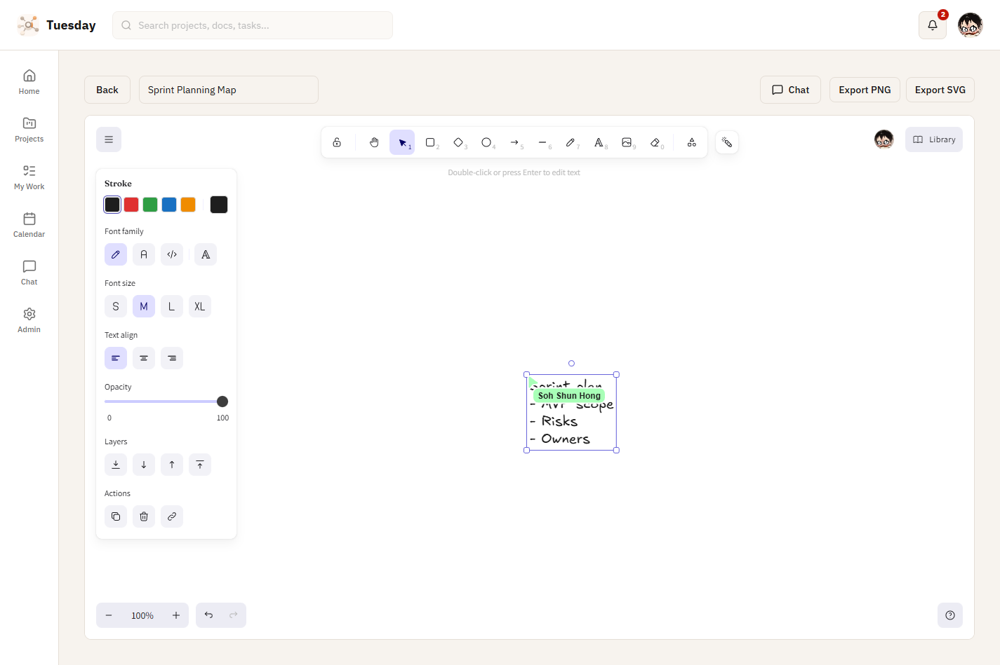
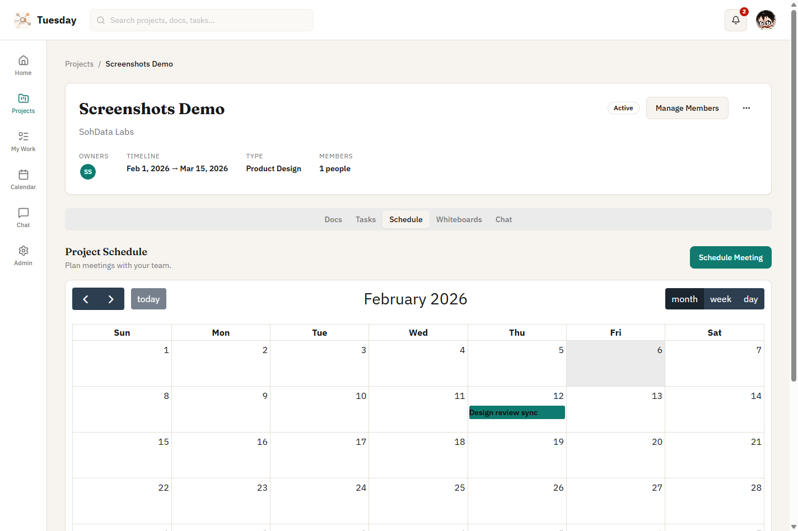

<div align="center">

# Tuesday

**A free, self-hosted alternative to Basecamp, Mattermost, Notion, and Monday.**

Run your team's work hub without per-seat SaaS pricing.

[](https://hub.docker.com/r/sohshunhong/tuesday)
[](https://hub.docker.com/r/sohshunhong/tuesday)
[](LICENSE)
[](CHANGELOG.md)

<br />



</div>

<br />

## Quick Start

```bash
docker run -d --name tuesday -p 8080:8080 -v tuesday_data:/app/data sohshunhong/tuesday:latest
```

Visit **http://localhost:8080** and complete the setup wizard. That's it.

Single Docker container. Embedded PostgreSQL. No external dependencies.

---

## Features

<table>
<tr>
<td width="50%" align="center">
<br />
<strong>Personal Dashboard</strong>
<br /><br />

<br />
Notifications, tasks, and upcoming meetings at a glance.
<br /><br />
</td>
<td width="50%" align="center">
<br />
<strong>Kanban Tasks</strong>
<br /><br />

<br />
Drag-and-drop boards with custom statuses and assignees.
<br /><br />
</td>
</tr>
<tr>
<td width="50%" align="center">
<br />
<strong>Document Editor</strong>
<br /><br />

<br />
Rich block editor with database-style properties and templates.
<br /><br />
</td>
<td width="50%" align="center">
<br />
<strong>Team Chat</strong>
<br /><br />

<br />
Channels, DMs, mentions, reactions, and typing indicators.
<br /><br />
</td>
</tr>
<tr>
<td width="50%" align="center">
<br />
<strong>Whiteboards</strong>
<br /><br />

<br />
Excalidraw-powered collaborative drawing with export support.
<br /><br />
</td>
<td width="50%" align="center">
<br />
<strong>Calendar & Meetings</strong>
<br /><br />

<br />
Project schedules and personal calendar with month/week views.
<br /><br />
</td>
</tr>
</table>

### Everything Included

- **Setup Wizard** - No config files needed, configure via browser
- **Authentication** - Secure session-based auth with bcrypt
- **Projects** - Organize work with members, roles, and custom statuses
- **Docs** - BlockNote editor with database views and real-time collaboration
- **Tasks** - Kanban boards with drag-and-drop, filters, and My Work view
- **Meetings** - Project and personal calendars
- **Whiteboards** - Excalidraw editor with real-time collaboration
- **Chat** - Channels, DMs, mentions, reactions, file attachments
- **Notifications** - Real-time inbox with WebSocket delivery
- **Teams** - Group users with cascading project access
- **Admin Panel** - User management, workspace settings, status configuration
- **File Uploads** - Attachments with automatic lifecycle management
- **Dark Mode** - Light, dark, and system theme support

---

## Why Tuesday?

| | Tuesday | SaaS Alternatives |
|---|---|---|
| **Cost** | Free, forever | $8-25/user/month |
| **Data** | Your server, your data | Vendor cloud |
| **Deployment** | Single Docker container | N/A |
| **Features** | Projects, docs, tasks, chat, whiteboards, calendar | Often split across multiple tools |
| **Setup** | 1 command, 30 seconds | Account creation, team setup, billing |

---

## Deployment

### Docker Hub (recommended)

```bash
docker run -d \
  --name tuesday \
  -p 8080:8080 \
  -v tuesday_data:/app/data \
  --restart unless-stopped \
  sohshunhong/tuesday:latest
```

### Build from Source

```bash
git clone https://github.com/your-org/tuesday.git
cd tuesday
docker compose up -d
```

### Reverse Proxy (HTTPS)

**Caddy** (automatic HTTPS):
```
tuesday.example.com {
    reverse_proxy localhost:8080
}
```

See [docs/deployment.md](docs/deployment.md) for Nginx configuration with WebSocket support.

---

## Documentation

| Document | Description |
|----------|-------------|
| [Deployment Guide](docs/deployment.md) | Docker deployment, reverse proxy setup |
| [Configuration](docs/configuration.md) | All environment variables |
| [Backup & Restore](docs/backup.md) | Backup and restore procedures |
| [Upgrade Guide](docs/upgrade.md) | Version upgrades and rollback |
| [Changelog](CHANGELOG.md) | Release history |

---

## Technology Stack

| Layer | Technology |
|-------|------------|
| Runtime | [Bun](https://bun.sh) |
| Backend | [Hono](https://hono.dev) |
| Database | PostgreSQL 16 (embedded) |
| ORM | [Drizzle](https://orm.drizzle.team) |
| Frontend | React 19 + TypeScript |
| UI | [shadcn/ui](https://ui.shadcn.com) |
| State | TanStack Query + Zustand |
| Editor | [BlockNote](https://www.blocknotejs.org) |
| Whiteboard | [Excalidraw](https://excalidraw.com) |
| Calendar | [FullCalendar](https://fullcalendar.io) |

---

<details>
<summary><strong>Development Setup</strong></summary>

### Prerequisites

- [Bun 1.x](https://bun.sh)
- Docker (for PostgreSQL)

### Backend

```bash
# Start PostgreSQL
docker compose -f docker-compose.dev.yml up -d

# Install dependencies and start
cd backend
bun install
bun run db:migrate
bun run dev
```

Backend runs at `http://localhost:8080`.

### Frontend

```bash
cd frontend
bun install
bun run dev
```

Frontend runs at `http://localhost:3000` and proxies API calls to the backend.

### First-Time Setup

1. Visit `http://localhost:3000`
2. Complete the setup wizard to create the admin account
3. Login and start exploring

### Common Commands

```bash
# Backend
cd backend
bun test                    # Run tests
bun test --coverage         # Tests with coverage
bun run typecheck           # Type check
bun run db:migrate          # Run migrations
bun run db:studio           # Open Drizzle Studio

# Frontend
cd frontend
bun test                    # Run tests
bun run typecheck           # Type check
bun run build               # Production build

# Docker
docker compose up -d        # Start
docker compose down         # Stop
docker compose logs -f      # View logs
docker compose build        # Rebuild image
```

</details>

<details>
<summary><strong>Configuration</strong></summary>

All settings are optional with sensible defaults.

| Variable | Default | Description |
|----------|---------|-------------|
| `TUESDAY_PORT` | `8080` | Host port mapping |
| `TUESDAY_BASE_URL` | `http://localhost:8080` | Public URL |
| `SESSION_SECRET` | Auto-generated | Session signing key (min 32 chars) |
| `SESSION_DURATION_HOURS` | `24` | Session expiry |
| `UPLOAD_MAX_SIZE_MB` | `10` | Max upload size |
| `RATE_LIMIT_ENABLED` | `true` | Enable rate limiting |
| `CORS_ORIGIN` | `http://localhost:5173` | CORS origin (dev only) |

See [docs/configuration.md](docs/configuration.md) for the full reference.

</details>

<details>
<summary><strong>API Reference</strong></summary>

Base path: `/api/v1`

**Setup**
- `GET /setup/status` - Check if setup is complete
- `POST /setup/complete` - Complete first-time setup

**Authentication**
- `POST /auth/register` - Register new user (if enabled)
- `POST /auth/login` - Login
- `POST /auth/logout` - Logout
- `GET /auth/me` - Current user info

**Projects**
- `GET /projects` - List my projects
- `POST /projects` - Create project
- `GET /projects/:id` - Get project
- `PATCH /projects/:id` - Update project
- `DELETE /projects/:id` - Delete project

**Tasks**
- `GET /projects/:id/tasks` - List project tasks
- `POST /projects/:id/tasks` - Create task
- `GET /tasks/:id` - Get task
- `PATCH /tasks/:id` - Update task
- `DELETE /tasks/:id` - Delete task
- `GET /tasks/my` - List my tasks

**Docs**
- `GET /projects/:id/docs` - List project docs
- `POST /projects/:id/docs` - Create project doc
- `GET /docs/:id` - Get doc
- `PATCH /docs/:id` - Update doc
- `DELETE /docs/:id` - Delete doc

**Meetings**
- `GET /projects/:id/meetings` - List meetings
- `POST /projects/:id/meetings` - Create meeting
- `GET /meetings/my` - List my meetings

**Whiteboards**
- `GET /projects/:id/whiteboards` - List whiteboards
- `POST /projects/:id/whiteboards` - Create whiteboard
- `GET /whiteboards/:id` - Get whiteboard

**Chat & DMs**
- `GET /channels` - List channels
- `POST /channels` - Create channel
- `GET /channels/:id/messages` - List messages
- `POST /channels/:id/messages` - Send message
- `GET /dms` - List DMs
- `POST /dms` - Create/open DM

**Teams**
- `GET /teams` - List teams
- `POST /teams` - Create team

**Notifications**
- `GET /notifications` - List notifications
- `POST /notifications/read-all` - Mark all as read

**Profile & Files**
- `GET /profile` - Get profile
- `PATCH /profile` - Update profile
- `POST /files` - Upload file
- `GET /files/:id` - Download file

</details>

<details>
<summary><strong>Project Structure</strong></summary>

```
tuesday/
├── backend/                 # Bun + Hono backend
│   ├── src/
│   │   ├── index.ts         # Entry point
│   │   ├── routes/          # API routes
│   │   ├── services/        # Business logic
│   │   ├── repositories/    # Database access (Drizzle)
│   │   ├── middleware/      # Auth, rate limiting, static serving
│   │   ├── db/              # Schema and migrations
│   │   ├── collab/          # Real-time collaboration hubs
│   │   └── utils/           # Helpers
│   └── package.json
│
├── frontend/                # React + shadcn/ui frontend
│   ├── src/
│   │   ├── pages/           # Route components
│   │   ├── components/      # UI components
│   │   ├── api/             # API clients
│   │   ├── hooks/           # Custom hooks
│   │   ├── store/           # Zustand state management
│   │   └── providers/       # React context providers
│   └── package.json
│
├── docs/                    # Operational documentation
├── scripts/                 # Backup/restore scripts
├── Dockerfile               # Production multi-stage build
├── docker-compose.yml       # Production deployment
├── docker-compose.dev.yml   # Development PostgreSQL
├── supervisord.conf         # Process management
├── entrypoint.sh            # Container initialization
└── .env.example             # Configuration template
```

</details>

<details>
<summary><strong>Security</strong></summary>

- **Authentication** - bcrypt password hashing (cost factor 12), secure HTTP-only session cookies with SameSite=Strict
- **Rate Limiting** - Auth endpoints limited to 5 requests/minute per IP
- **Access Control** - Two-level model: workspace role (admin/member) + project membership (owner/member)
- **SQL Injection** - Prevented via Drizzle ORM parameterized queries
- **XSS Prevention** - React auto-escaping + server-side sanitization
- **Security Headers** - CSP, X-Frame-Options, X-Content-Type-Options, Referrer-Policy

</details>

<details>
<summary><strong>Troubleshooting</strong></summary>

**Container won't start**
```bash
docker compose logs --tail 50
```

**Can't connect to database (development)**
```bash
docker ps | grep tuesday-dev-db
docker compose -f docker-compose.dev.yml up -d
```

**WebSocket not connecting through reverse proxy**

Ensure your proxy passes `Upgrade` and `Connection` headers. See [docs/deployment.md](docs/deployment.md).

**Reset to fresh state**
```bash
docker compose down -v
docker compose up -d
```

</details>

---

## Contributing

1. Fork the repository
2. Create a feature branch (`git checkout -b feature/amazing-feature`)
3. Follow the guidelines in [AGENTS.md](AGENTS.md)
4. Run tests (`bun test` in both `backend/` and `frontend/`)
5. Commit (`git commit -m 'feat: add amazing feature'`)
6. Push and open a Pull Request

---

<div align="center">

**[Documentation](docs/deployment.md)** &middot; **[Docker Hub](https://hub.docker.com/r/sohshunhong/tuesday)** &middot; **[Changelog](CHANGELOG.md)**

MIT License &copy; 2026 UltreonAI

</div>
